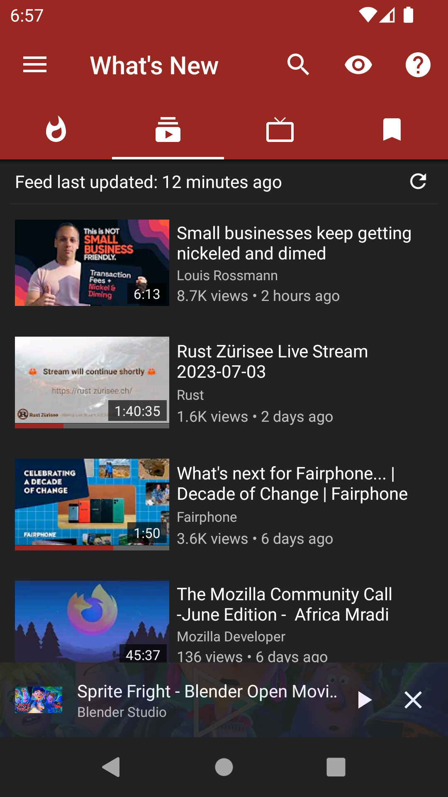
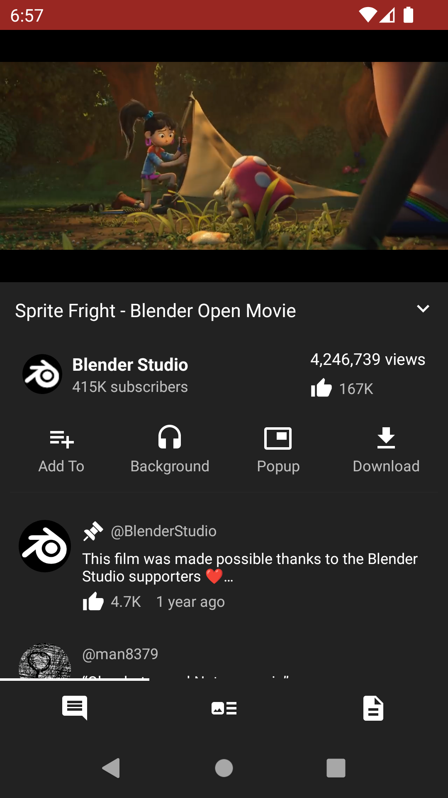
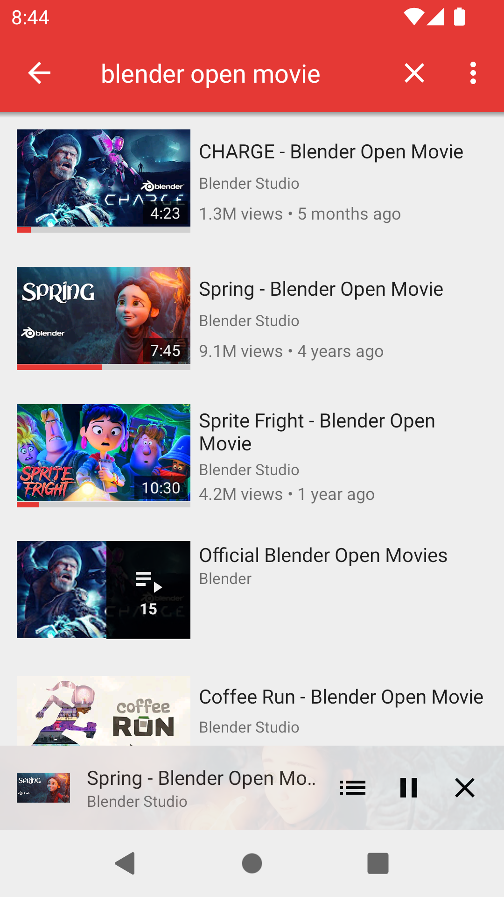
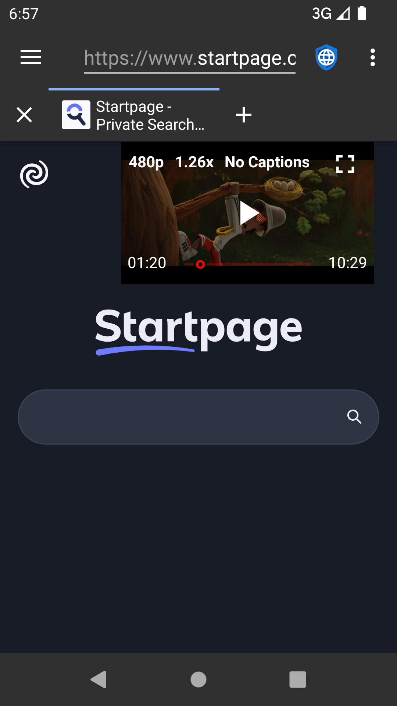

## 📣 NewPipe (Refactor Branch)

<p align="center">
  
</p>

<h2 align="center"><strong>NewPipe</strong></h2>
<h4 align="center">A modern, lightweight, open-source streaming app for Android</h4>

<p align="center">
  <a href="https://github.com/nidoham/NewPipe"><strong>🚀 Currently under active development and refactoring!</strong></a><br/>
  <em>We're redesigning and improving performance, UX, and features. Contributions are welcome!</em>
</p>

<p align="center">
  <a href="https://github.com/nidoham/NewPipe/releases"><strong>⬇️ No official version released yet — stay tuned!</strong></a>
</p>

<p align="center">
  <a href="https://t.me/codewithni"><strong>📣 Join our Telegram for updates & help → t.me/codewithni</strong></a>
</p>

---

<p align="center">
  
  
  
  
</p>

---

## 📷 Screenshots

<p align="center">
  
  
  
  
</p>

---

## ✅ Supported Services

* [YouTube](https://www.youtube.com/) & [YouTube Music](https://music.youtube.com/)
* [PeerTube](https://joinpeertube.org/)
* [Bandcamp](https://bandcamp.com/)
* [SoundCloud](https://soundcloud.com/)
* [media.ccc.de](https://media.ccc.de/)

More services to come — help us extend support!

---

## 🚀 Features

* Watch videos in up to 4K
* Audio-only & background playback
* Popup (Picture-in-Picture) player
* Livestream support
* Subtitles & captions
* Download videos/audio
* Channel subscriptions (no account needed)
* History, bookmarks, and local playlists
* Kodi integration
* Private by design — no tracking

---

## 📦 Installation

This version is still in active development. No stable builds are released yet.

### 🔧 Build from Source

You can clone this repo and build debug APKs manually:

```bash
git clone https://github.com/nidoham/NewPipe.git
cd NewPipe
./gradlew assembleDebug
```

> ✅ Tip: Make sure `gradlew` is executable: `chmod +x ./gradlew`

---

## 👨‍💻 Contribute

We welcome contributions in any form — code, testing, translations, ideas!

* Report issues
* Submit pull requests
* Improve documentation
* Help others on Telegram: [t.me/codewithni](https://t.me/codewithni)

---

## 📊 Analytics & Roadmap

* 📥 **GitHub Downloads**: 
* 👁️ **Views**: 
* 🧭 Feature roadmap coming soon in Issues & Projects tab

---

## 📜 License

This project is licensed under the [GNU GPLv3](https://www.gnu.org/licenses/gpl-3.0.html).

Free to use, study, share, and improve — forever.

<p align="center">
  
</p>

---

<p align="center"><strong>Made with ❤️ by contributors & the community — join us!</strong></p>
